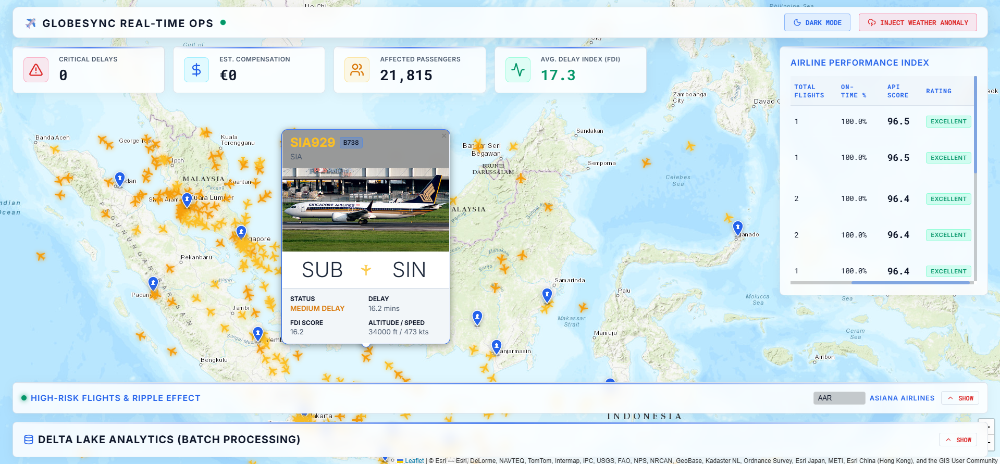
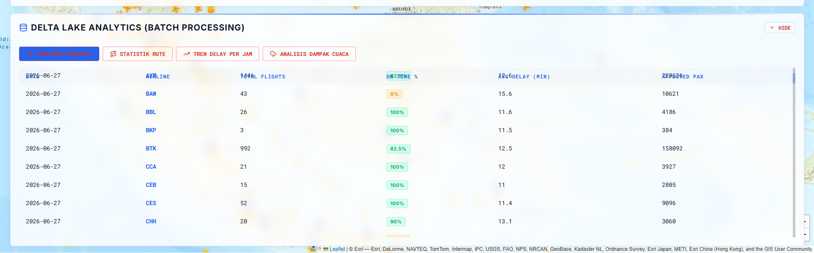

# Sistem-Prediksi-Keterlambatan-Penerbangan-Komersial






Sistem big data real-time untuk memprediksi keterlambatan penerbangan komersial dan mengukur dampaknya terhadap jaringan penerbangan, penumpang, serta biaya maskapai.

## Quick Start

```bash
cd Sistem-Prediksi-Keterlambatan-Penerbangan-Komersial
docker compose up --build -d
```

Cek Kafka producer:
```bash
docker logs -f flight-producer
```

Akses backend API:
```bash
curl http://localhost:8000/
```

Menjalankan Dashboard (Frontend):
```bash
cd Dashboard
npm install
npm run dev
```
Buka browser dan akses dashboard pada: `http://localhost:5173/`

---

## Arsitektur Sistem

```
FlightRadar24 API  +  Open-Meteo API & Bright Sky API (cuaca)
        ↓
   flight-producer (Producer/)
        ↓
   Kafka topic: commercial-flight-stream
        ↓
   spark-processor (Spark/)
        ↓
   Redis (real-time)  +  Kafka topic: flight-predictions  +  Delta Lake (histori)
        ↓
   backend (Backend/)  ← FastAPI + WebSocket untuk dashboard
```

| Service | Port | Fungsi |
|---------|------|--------|
| `kafka` | `9092` | Message broker |
| `kafka-ui` | `http://localhost:8080` | Monitor Kafka |
| `redis` | `6379` | Output real-time & rotasi pesawat |
| `flight-producer` | — | Data ingestion FR24 + cuaca |
| `spark-processor` | — | ML inference + feature engineering |
| `backend` | `8000` | REST API + WebSocket |

---

## Evolusi Desain: Dari Rancangan Awal ke Setelah Saran Dosen

### Rancangan Awal (Sebelum Anggota 4)

Rancangan awal difokuskan pada **prediksi keterlambatan penerbangan** dengan arsitektur streaming sederhana:

| Aspek | Rancangan Awal |
|-------|----------------|
| **Sumber data** | FlightRadar24 real-time + cuaca Open-Meteo & Bright Sky (Fallback) |
| **ML model** | RandomForestRegressor untuk memprediksi `delay_minutes` |
| **Output** | `predicted_delay_minutes` dan `delay_category` (ON TIME / MEDIUM / CRITICAL) |
| **Storage** | Redis untuk real-time, Kafka untuk downstream |
| **Visualisasi** | Dashboard membaca langsung dari Redis |

Output yang dihasilkan bersifat **reaktif**: hanya memberitahu "berapa lama delay-nya" tanpa konteks dampak lebih luas.

### Saran Dosen & Perubahan yang Dilakukan

Dosen memberikan masukan bahwa prediksi keterlambatan sudah umum tersedia di berbagai platform. Oleh karena itu, sistem perlu menunjukkan **keunggulan diferensiasi** melalui:

1. **Sumber data tambahan** (historis & kontekstual)
2. **Output yang lebih komprehensif** — tidak hanya delay, tapi juga indeks, dampak jaringan, estimasi penumpang & biaya
3. **Airline Performance Index** — transparansi performa per maskapai

Berikut perubahan signifikan yang telah diimplementasikan:

#### 1. Penambahan Sumber & Fitur Data

| Data Baru | Implementasi |
|-----------|--------------|
| **Aircraft capacity** | Lookup table tipe pesawat di Spark |
| **Aircraft rotation tracking** | Redis sorted set `rotation:<registration>` |
| **Hub airport classification** | Daftar bandara hub di Backend |
| **Traffic density** | Feature engineering dari jam & hari di Spark |

Meskipun data historis OTP, NOTAM, kondisi runway, dan jadwal rotasi penuh belum terintegrasi (terbatas akses API berbayar), sistem sudah membangun **fondasi rotasi & kapasitas pesawat** yang dapat diperluas.

#### 2. Output/Metrik Baru

| Metrik | Penjelasan |
|--------|------------|
| **Flight Delay Index (FDI)** | Skor komposit 0–100 yang lebih intuitif dari "menit delay" |
| **Ripple Effect Score (RES)** | Estimasi dampak delay terhadap penerbangan lanjutan |
| **Affected Passengers** | Estimasi jumlah penumpang terdampak |
| **Estimated Compensation** | Estimasi biaya kompensasi maskapai (EUR) |
| **Airline Performance Index (API)** | Ranking performa maskapai berdasarkan data real-time |

#### 3. Penyimpanan Historis

| Komponen | Perubahan |
|----------|-----------|
| **Delta Lake** | Spark sekarang menulis hasil prediksi ke `./delta_lake/flight_predictions` untuk analisis historis |
| **Redis** | Tetap digunakan untuk real-time dengan TTL 5 menit |

#### 4. Backend API & WebSocket

Dari sekadar membaca Redis, Backend sekarang menjadi **orkestrator output**:
- REST endpoints untuk flights, stats, alerts, impact, ripple, dan airlines
- WebSocket push real-time setiap 10 detik
- Background alert scanner untuk CRITICAL DELAY

---

## Fitur Lengkap Saat Ini

### A. Prediksi Keterlambatan (Anggota 2+3)
- RandomForestRegressor dengan feature engineering lengkap
- Kategori delay: ON TIME / MEDIUM DELAY / CRITICAL DELAY

### B. Flight Delay Index (FDI)
Skor 0–100 dengan bobot:
```
FDI = normalized_delay×40 + weather_score×25 + traffic_density×1.5 + route_deviation×0.2 + is_peak_hour×10
```
Kategori: LOW / MODERATE / HIGH / CRITICAL

### C. Ripple Effect Score (RES)
Estimasi dampak delay merembet ke penerbangan lanjutan.

| Faktor | Bobot |
|--------|-------|
| Rotation tightness | 30% |
| Downstream flights | 20% |
| Hub destination | 20% |
| Delay magnitude | 15% |
| Time recovery | 10% |
| FDI | 5% |

### D. Affected Passengers & Estimated Compensation
- `affected_passengers = capacity × load_factor (0.85)`
- Compensation berbasis jarak & delay (model EU261 sederhana)

### E. Airline Performance Index (API)
Ranking maskapai berdasarkan data real-time.

```
API = on_time_rate×40 + (1-normalized_avg_delay)×25 + (1-critical_rate)×20
      + (1-normalized_avg_fdi)×10 + (1-normalized_avg_res)×5
```

Kategori: EXCELLENT (≥80) / GOOD (≥60) / FAIR (≥40) / POOR (<40)

---

## Backend REST Endpoints

> Dokumentasi lengkap untuk frontend tersedia di [`API_CONTRACT.md`](./API_CONTRACT.md). FastAPI juga menyediakan docs interaktif di `http://localhost:8000/docs`.

| Method | Endpoint | Deskripsi |
|--------|----------|-----------|
| GET | `/` | Info service |
| GET | `/api/flights` | Semua penerbangan aktif |
| GET | `/api/flights/{id}` | Detail satu penerbangan |
| GET | `/api/flights/{id}/impact` | Metrik dampak (FDI, RES, pax, compensation) |
| GET | `/api/flights/{id}/ripple` | Ripple Effect Score detail |
| GET | `/api/stats` | Statistik ringkasan dari Redis |
| GET | `/api/alerts` | Daftar penerbangan CRITICAL DELAY |
| GET | `/api/impact` | Agregat impact semua penerbangan |
| GET | `/api/airlines` | Ranking performa semua maskapai |
| GET | `/api/airlines/{icao}` | Detail performa satu maskapai |
| WS | `/ws/flights` | Push real-time setiap 10 detik |

### Contoh Penggunaan

```bash
# Cek impact satu penerbangan
curl http://localhost:8000/api/flights/4039151e/impact

# Cek Ripple Effect Score
curl http://localhost:8000/api/flights/4039151e/ripple

# Cek agregat impact
curl http://localhost:8000/api/impact

# Cek ranking maskapai
curl http://localhost:8000/api/airlines

# Cek detail maskapai
curl http://localhost:8000/api/airlines/AXM
```

---

## Catatan & Batasan

1. **Ripple Effect Score membutuhkan waktu** — Data rotasi (`rotation:<registration>`) terkumpul bertahap seiring producer mengirim data. Hasil RES akan lebih bermakna setelah beberapa menit berjalan.

2. **Airline Performance Index adalah snapshot real-time** — API dihitung dari penerbangan aktif di Redis. Untuk analisis historis jangka panjang, bisa diperluas dengan agregasi dari Delta Lake.

3. **Beberapa sumber data dosen masih belum terintegrasi penuh** karena akses API berbayar/registrasi, seperti:
   - NOTAM resmi global
   - Kondisi runway real-time
   - Jadwal rotasi pesawat lengkap
   - Data historis OTP resmi

   Sistem sudah mempersiapkan fondasi (rotasi, hub, kapasitas) untuk integrasi ini di masa depan.

---

## Tim Pengembang

| Anggota | Tugas |
|---------|-------|
| Anggota 1 | Producer: data ingestion FR24 + cuaca |
| Anggota 2 | Spark streaming & ML inference |
| Anggota 3 | ML features & RandomForestRegressor |
| Anggota 4 | Delta Lake, Redis alerts, FastAPI + WebSocket, FDI, RES, API |
| Anggota 5 | Dashboard React, Tema Enterprise, UI/UX Real-time FR24 Style |
